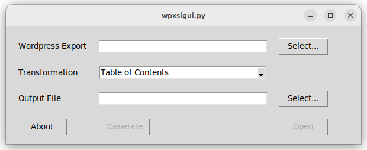

# wpxslgui.py

Python port of [wpxslgui](https://gforge.devio.at/projects/wpxslgui/)

> wpxslgui converts an XML File generated by the WordPress Export function into an HTML or Word HTML document.



```
git clone https://github.com/devio-at/wpxslgui.py.git
python ./wpxslgui.py 
```

